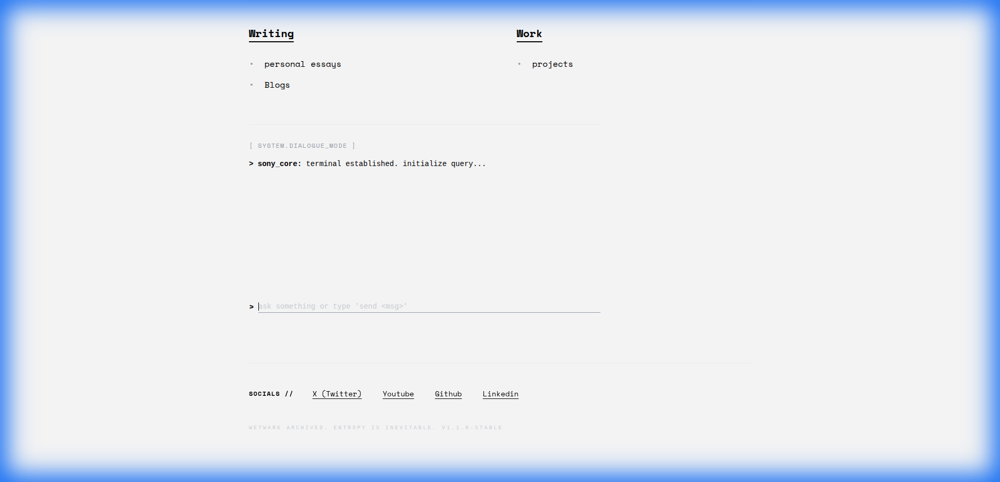

# KAVINDRA SONY // PORTFOLIO



> **"A digital extension of the mind."**
>
> A zero-dependency, cyber-minimalist portfolio built on React + Vite. Features a custom Markdown CMS, a functional command-line interface, and a focus on high-fidelity typography.

---

## 🚀 Live Demo
**[Comming Soon]**

## 🧠 Engineering Philosophy

### 1. The "Files-as-Database" Architecture
This project rejects the complexity of Headless CMSs and databases for a personal site.
- **Content is Code**: Blogs and Projects are just Markdown files in `content/`.
- **Zero-Latency**: Content is loaded at build-time using Vite's `import.meta.glob`.
- **Portable**: The entire site—content and logic—lives in a single git repo.

### 2. High-Performance Terminal
The terminal isn't a simple overlay; it's deeply integrated into the router.
- **Navigation**: `cd`, `open`, and `ls` commands control the React Router.
- **Secrets**: Try typing `hack`, `sudo`, `42`, or `joke`.
- **Messaging**: A secure webhook integration allows "anonymous" communication.

### 3. Cyber-Minimalism
- **No Framework Bloat**: Styling is kept raw and functional.
- **Typography First**: Content readability is prioritized over flashy effects.
- **Math Ready**: Full LaTeX support ($e^{i\pi} + 1 = 0$) for research papers.

---

## 🛠️ Tech Stack
- **Core**: React 18, TypeScript, Vite
- **Styling**: TailwindCSS
- **Markdown Engine**: `react-markdown`, `remark-math`, `rehype-katex`, `rehype-highlight`
- **State**: React Hooks (No Redux/Zustand needed)

---

## 💻 Running Locally

```bash
# 1. Clone the repository
git clone https://github.com/thisizkavi-lab/kavi-web.git

# 2. Install dependencies
npm install

# 3. Enter the matrix
npm run dev
```

## 📝 Managing Content

### Adding a Blog Post
Create a file in `content/blogs/my-post.md`:
```markdown
---
id: "my-post"
title: "The Future of Interface"
date: "2024-06-20"
excerpt: "Why keyboards will outlive touchscreens."
---
# Content Here
```

### Adding a Project
Create a file in `content/projects/my-project.md`:
```markdown
---
id: "my-project"
title: "Neural Net v1"
category: "AI / ML"
stack: "Python, PyTorch"
metrics:
  - label: "Accuracy"
    value: 99.2
---
```

---

## 📜 License
MIT © [Kavindra Sony](https://github.com/thisizkavi-lab)
